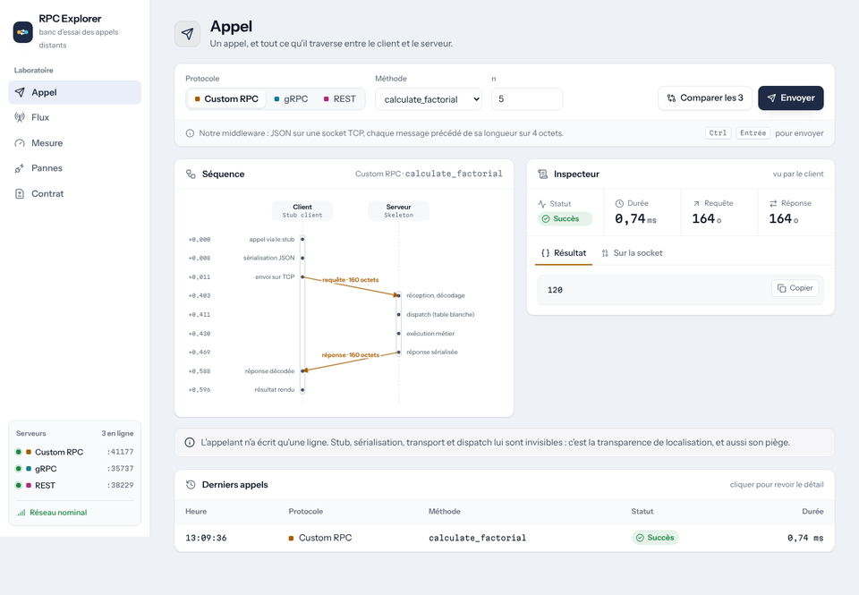
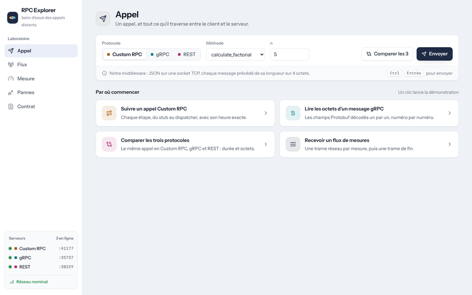
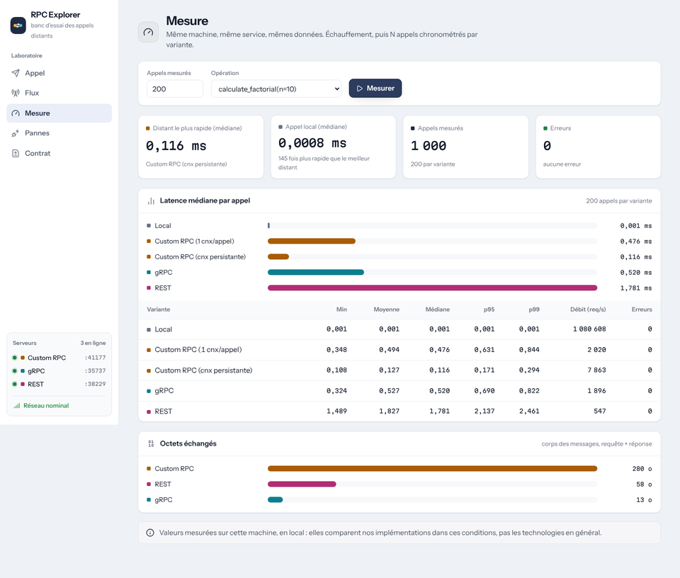
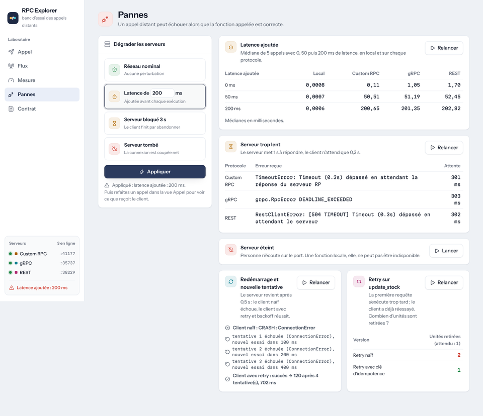
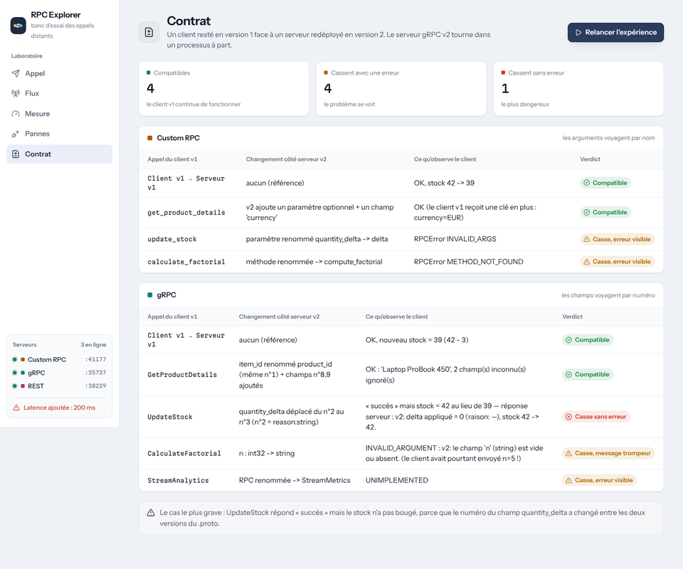

# RPC Explorer & Benchmark Lab

**Laboratoire pédagogique des Remote Procedure Calls (RPC)** — Custom RPC « from scratch », gRPC/Protobuf et REST, comparés autour d'un même service métier.

> Objectif : transformer les concepts théoriques du RPC en phénomènes **observables, mesurables et expérimentables**.

👉 Nouveau sur le sujet ? Commencez par **[`docs/GUIDE_COMPRENDRE.md`](docs/GUIDE_COMPRENDRE.md)** (explication pas à pas, sans prérequis).



---

## Ce que le projet démontre

| Démonstration | Commande | Ce qu'on observe |
|---|---|---|
| **Tableau de bord web** | `python main.py --dashboard` | tout ce qui suit dans le navigateur, sans Internet : diagramme de séquence de chaque appel, octets Protobuf colorés par champ, comparaison des 3 protocoles, flux en direct, mesures, pannes, contrat |
| Menu interactif « RPC Explorer » | `python main.py` | choisir protocole, méthode, arguments ; activer « Sous le capot » ; injecter une panne |
| Sous le capot | `python main.py --under-the-hood` | les 9 étapes d'un appel Custom RPC, les octets Protobuf décodés champ par champ, la requête HTTP brute |
| Transparence de localisation | `python main.py --transparency-demo` | le même `update_stock` écrit en local / Custom RPC / gRPC / REST, et son coût |
| Benchmark | `python main.py --benchmark --iterations 1000` | latence (min, moyenne, médiane, p95, p99), débit, tailles JSON vs Protobuf, coût de sérialisation |
| Réponse unique vs streaming | `python main.py --streaming-demo` | délai avant la 1re donnée : flux trame par trame vs une seule réponse |
| Local ≠ distant | `python main.py --simulate-failures` | latence injectée, timeout, serveur éteint, retry + backoff, **double exécution** d'un retry non idempotent |
| Évolution de contrat | `python main.py --contract-demo` | client v1 face à un serveur v2 : changements compatibles, erreurs visibles et **bugs silencieux** |
| Tout, dans l'ordre | `python main.py --demo` | le scénario de soutenance complet |
| Vrai client/serveur séparés | `python main.py --serve all --trace` puis `python main.py --call custom calculate_factorial n=5 --trace` | deux processus (ou deux machines avec `--host`) |

---

## Installation

```bash
git clone https://github.com/salaheddinehalimisiad-coder/rpc-explorer-benchmark-lab.git
cd rpc-explorer-benchmark-lab

python -m venv venv
venv\Scripts\activate          # Windows
# source venv/bin/activate     # Linux / macOS

pip install -r requirements.txt
python -m pytest -q            # toute la suite de tests
python main.py                 # menu interactif
```

> **Windows et conflits de versions.** Le projet demande `protobuf >= 7.35`. Si d'autres outils installés sur le même Python (tensorflow, streamlit…) exigent une version plus ancienne, pip affiche des « dependency conflicts » : ils ne concernent pas ce projet, mais l'environnement virtuel ci-dessus évite tout mélange. Le tableau de bord s'ouvre ensuite sur http://127.0.0.1:8080 (`--port` pour en changer).

Le code Protobuf généré est versionné. Pour le régénérer après une modification d'un `.proto` :

```bash
python scripts/generate_protos.py
```

---

## Le tableau de bord

| | |
|---|---|
|  |  |
| **Appel** : points de départ guidés, comparaison des 3 protocoles, historique | **Mesure** : latence médiane, percentiles, débit, octets échangés |
|  |  |
| **Pannes** : dégrader les serveurs, expériences de timeout, retry, idempotence | **Contrat** : client v1 face à un serveur v2, verdict par changement |

Raccourci : <kbd>Ctrl</kbd> + <kbd>Entrée</kbd> envoie l'appel. Les polices et icônes sont embarquées (licences libres OFL et ISC, voir `dashboard/static/`).

---

## Architecture

```
                      ┌───────────────────────────────┐
                      │  main.py / cli (RPC Explorer) │
                      │  lab/ (démos, benchmark)      │
                      └──────────────┬────────────────┘
          ┌──────────────────────────┼──────────────────────────┐
          ▼                          ▼                          ▼
   Custom RPC (rpc_core)       gRPC (grpc_impl)            REST (rest)
   stub → JSON → TCP           stub généré → Protobuf      requests → JSON
   skeleton + dispatcher       → HTTP/2                    → HTTP/1.1 → Flask
          └──────────────────────────┼──────────────────────────┘
                                     ▼
                      business/inventory_service.py
              (logique métier pure : aucune notion de réseau)
```

| Dossier | Rôle |
|---|---|
| `rpc_core/` | mini-framework RPC écrit à la main : `serializer` (JSON), `transport` (trame TCP préfixée par la longueur), `client_stub` (appel transparent, connexion persistante, appel asynchrone, streaming), `server_skeleton` (dispatcher à table blanche), `resilience` (retry explicite) |
| `protos/inventory.proto` | **contrat IDL** gRPC (v1) + code généré `inventory_pb2*.py` |
| `grpc_impl/` | serveur et client gRPC (unaire + server streaming) |
| `rest/` | serveur Flask et client `requests` |
| `business/` | service métier : `calculate_factorial`, `get_product_details`, `update_stock`, `stream_analytics` |
| `under_the_hood/` | traceur du cycle RPC, décodeur binaire Protobuf, intercepteur gRPC, démo comparée |
| `benchmark/` | moteur de mesure (adaptateurs Local / Custom / gRPC / REST, métriques) |
| `failure_simulator/` | injection de latence, timeout, crash, messages corrompus |
| `contract_evolution/` | contrat v2 + serveur v2 (processus séparé) + démo client v1 / serveur v2 |
| `lab/` | lancement des 3 serveurs, démos transparence / pannes / benchmark |
| `cli/` | menu interactif |
| `dashboard/` | tableau de bord web local : API Flask (`app.py`) + une page HTML, polices et icônes embarquées (`static/`) |
| `tests/` | tests unitaires, d'intégration et de bout en bout |

> Le package gRPC s'appelle `grpc_impl` et non `grpc` pour ne pas masquer la bibliothèque officielle `grpc` (grpcio).

---

## Méthodologie du benchmark

- warm-up puis N appels mesurés (configurables : `--iterations`, `--warmup`) ;
- même machine, même service, mêmes données pour tous les protocoles ;
- conditions (OS, CPU, versions Python/grpcio/protobuf/Flask) affichées et enregistrées dans `results/benchmark_*.json` ;
- Custom RPC est mesuré **deux fois** : une connexion TCP par appel, puis connexion persistante (comme le canal gRPC) — pour ne pas comparer des choses différentes sans le dire ;
- tailles de messages : corps sérialisés uniquement (l'enveloppe de transport est indiquée à part).

Aucun résultat n'est figé dans ce README : **lancez le benchmark sur votre machine**. Les conclusions ne valent que pour les conditions mesurées (localhost, serveur Flask de développement, etc.).

---

## Tests

```bash
python -m pytest -q                       # tout
python -m pytest tests/test_custom_rpc.py # un module
python -m pytest --cov=rpc_core --cov=grpc_impl --cov=rest --cov=business
```

La CI GitHub Actions (`.github/workflows/tests.yml`) exécute les tests sous Linux et Windows, vérifie que le code Protobuf généré correspond aux `.proto`, et lance un benchmark court.

---

## Feuille de route

| Phase | Contenu | État |
|---|---|---|
| 01 | Fondation, arborescence, contrat `.proto` | ✅ |
| 02 | Custom RPC core (sérialisation, transport, stub, skeleton) | ✅ |
| 03 | Service métier | ✅ |
| 04 | gRPC (unaire + streaming) | ✅ |
| 05 | REST | ✅ |
| 06 | Moteur de benchmark | ✅ |
| 07 | Simulateur de pannes | ✅ |
| 08 | Sous le capot (traceur, inspecteur Protobuf) | ✅ |
| 09 | Transparence, retry, idempotence | ✅ |
| 10 | Évolution de contrat | ✅ |
| 11 | CLI interactif + `main.py` | ✅ |
| 12 | Streaming Custom RPC + tableau de bord web | ✅ |
| 13 | Refonte visuelle et ergonomique du tableau de bord | ✅ |

Pistes futures (non implémentées) : client streaming / streaming bidirectionnel gRPC, tests sur un vrai réseau entre deux machines.

---

## Auteur

**Salah Eddine Halimi** — projet de Systèmes Distribués / Middleware.
